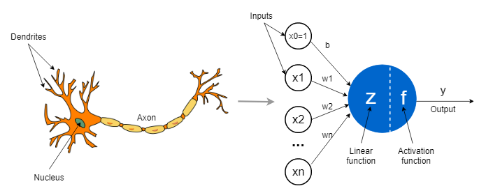
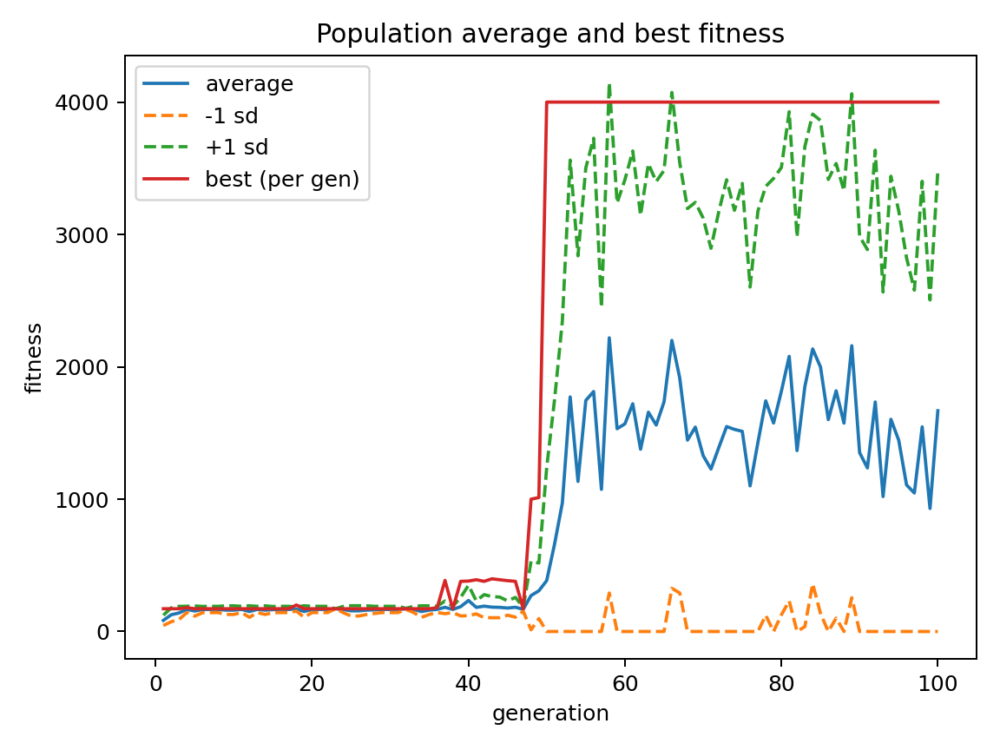
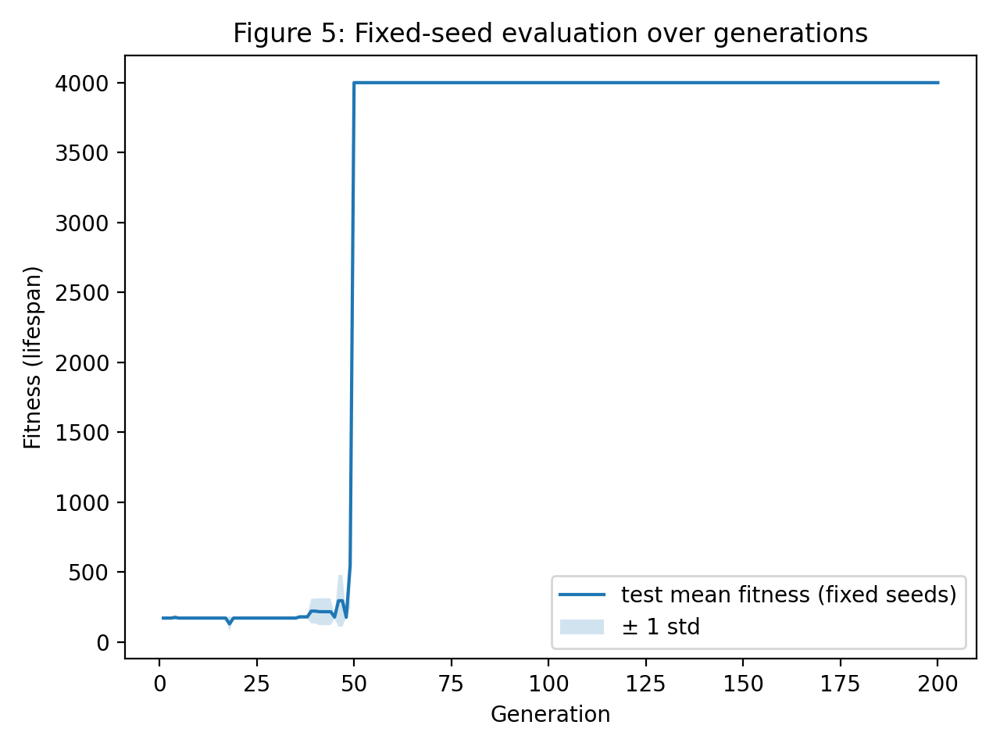
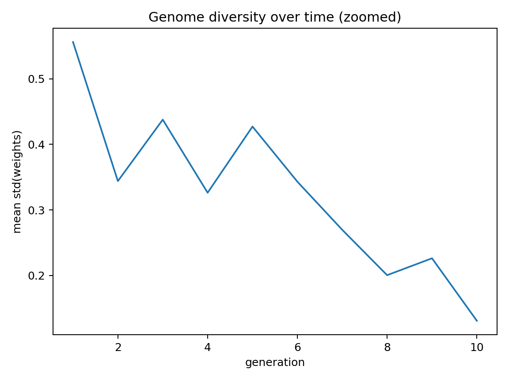

# Flappy Bird Neuroevolution Simulator

A headless neuroevolution trainer and interactive Pygame demonstration for evolving a minimal perceptron policy to play Flappy Bird, featuring PRML-style analysis and reproducible experiments.

<p align="center">
  
</p>

---

## Accompanying Paper

This project was developed as part of **COGS 118B** (UC San Diego, Prof. Virginia De Sa). The complete paper is available in the repository:

📄 **[Fast Neuroevolution for Flappy Bird: A Headless Simulator and PRML‑Style Analysis of a Simple Neuron Policy (PDF)](paper/A%20Headless%20Simulator%20and%20PRML%E2%80%91Style%20Analysis%20of%20a%20Simple%20Neuron%20Policy.pdf)**

The paper covers:
- The necessity and implementation of the headless simulator to bypass rendering bottlenecks.
- The "simple neuron" controller design (perceptron + sigmoid + threshold).
- Learning curves, fixed-seed generalization tests, and population diversity analysis.
- Convergence properties, fitness capping limitations, and potential extensions.

---

## Highlights

| Feature | Detail |
|---|---|
| **Neural Architecture** | Fixed-topology perceptron — 3 vision inputs + 1 bias → sigmoid → 1 output (flap/no-flap) |
| **Evolution Strategy** | Truncation selection with elitism, Gaussian weight mutation, no crossover |
| **Headless Training** | `fast_train_plus.py` — zero rendering, full logging, runs 200 generations in seconds |
| **Live Visualization** | `main.py` — real-time Pygame demo with fitness graph, speed slider, and brain debug overlay |
| **Champion Replay** | `viewer_player.py` — load saved weights and watch the best bird play |
| **Reproducibility** | Deterministic seeds, fixed-seed evaluation across 5 environments, full CSV + NPZ logging |
| **Analysis Pipeline** | Automated learning curves, train-vs-test plots, PCA of genomes, policy decision surfaces |

---

## How It Works

Each bird's controller is modeled as a single artificial neuron (perceptron):



```
vision[0]  ─── w₁ ──╮
vision[1]  ─── w₂ ──┤──▶  Σ  ──▶  σ(x)  ──▶  flap if output > 0.73
vision[2]  ─── w₃ ──┤
bias (1.0) ─── w₄ ──╯
```

**Inputs** (normalized distances to the nearest pipe):
1. Distance from bird center to top pipe edge (normalized by screen height)
2. Horizontal distance to the pipe (normalized by screen width)
3. Distance from bird center to bottom pipe edge (normalized by screen height)

**Output**: Sigmoid activation function. If the output value crosses `0.73`, the bird flaps.

**Evolution**: In each generation, the population is simulated, ranked by fitness (survival steps), and the top performers are cloned and mutated to form the next generation. No gradient descent is used—the weights evolve purely through selection and random mutation.

---

## Results at a Glance

Training configuration: `seed=0, pop=20, gens=200, max_steps=4000`

- **Generation ~50**: Best bird first reaches the fitness cap of 4000 (survived the entire episode).
- **Generation 50–200**: Best policy consistently hits 4000 across all 5 fixed evaluation seeds.
- **Convergence**: Population diversity (standard deviation of weights) drops steadily as the population converges on a winning strategy.

### Experimental Visualizations

| Learning Performance | Generalization & Stability | Population Diversity |
| :---: | :---: | :---: |
|  |  |  |
| *Learning curve showing best and average fitness over generations.* | *Fixed-seed evaluation stability across 5 independent evaluation seeds.* | *Standard deviation of connection weights showing population convergence.* |

---

## Quick Start

### Setup
```bash
python -m venv .venv

# Windows
.\.venv\Scripts\pip install -r requirements.txt

# macOS / Linux
source .venv/bin/activate && pip install -r requirements.txt
```

### Interactive Demo (Pygame)
```bash
python main.py
```
Watch 100 birds evolve in real-time with a live fitness graph, speed slider (arrow keys or drag), and neural output overlay.

### Headless Training
```bash
python fast_train_plus.py \
  --seed 0 --gens 200 --pop 20 --max_steps 4000 \
  --logdir runs/exp1 \
  --save_pop_every 1 --save_policy_every 1 \
  --eval_every 1 --eval_seeds 0,1,2,3,4
```

### Replay Champion
```bash
python viewer_player.py --weights_csv runs/exp1/best_genome_weights.csv
```
*Controls*: `[` / `]` adjust ticks-per-frame · `-` / `=` adjust FPS · `R` reset · `ESC` quit

### Generate Analysis Plots
```bash
python analyze_run_pretty.py runs/exp1
python make_charts.py runs/exp1
python plot_fig5_fixed_seed_eval.py --csv runs/exp1/gen_stats.csv
```

---

## Project Structure

```
├── main.py                    # Interactive Pygame demo with live stats overlay
├── fast_train_plus.py         # Headless trainer — the core experiment runner
├── viewer_player.py           # Champion replay viewer
│
├── brain.py                   # Fixed-topology perceptron (3+1 inputs → 1 output)
├── node.py                    # Node with sigmoid activation
├── connection.py              # Weighted connections with mutation logic
├── player.py                  # Bird agent: physics, vision, decision threshold
├── population.py              # Population management and speciation (Pygame mode)
├── species.py                 # Species grouping by weight similarity
│
├── components.py              # Pygame pipe and ground objects
├── config.py                  # Mutable global config (window, pipes, ground)
├── speed_slider.py            # Pygame slider widget
│
├── analyze_run_pretty.py      # Smoothed learning curves
├── make_charts.py             # Full analysis suite (PCA, diversity, policy surfaces)
├── plot_fig5_fixed_seed_eval.py  # Fixed-seed evaluation plots
│
├── paper/                     # Accompanying research paper (.pdf and .docx) and figures
├── runs/                      # Training output directory (created at runtime)
├── requirements.txt           # pygame, matplotlib, numpy
└── preview.gif                # Demo animation
```

---

## Training Output

Each run in `runs/<experiment>/` produces:

| File | Description |
|---|---|
| `run_config.json` | Full hyperparameter snapshot |
| `gen_stats.csv` | Per-generation stats (fitness, pipes, flap rate, diversity, test metrics) |
| `best_genome_weights.csv` | Champion bird's 4 connection weights |
| `pop_snapshot_genXXXX.npz` | Full population weight matrix (requires numpy) |
| `policy_snapshot_genXXXX.npz` | Decision surface grid (requires numpy) |

---

## Technical Notes

- **Fitness**: Defined as lifespan (number of simulation steps survived), capped at `max_steps`.
- **Mutation**: 80% chance per genome; each weight has a 10% chance of a full reset to a uniform random value $U(-1, 1)$, and a 90% chance of Gaussian perturbation $N(0, 0.1)$, clamped to $[-1, 1]$.
- **Decision threshold**: Hardcoded at 0.73 in Pygame mode (`main.py`), and configurable via the `--threshold` flag in headless mode.
- **Headless Mode**: Sets `SDL_VIDEODRIVER=dummy` and `config.window=None` to allow execution on CLI environments without a display driver.

---

## Known Gotchas and Discrepancies

This codebase contains several deviations between the interactive Pygame simulator and the headless trainer, which are important to note for replication:

- **Physics Speed Difference**: In interactive Pygame mode (`components.Pipes`), pipe speed is set to `1 px/tick`. In headless mode (`fast_train_plus.Pipe` and `viewer_player.Pipe`), it is set to `2.5 px/tick`. A policy trained headlessly may struggle in Pygame mode without speed adaptation.
- **Vision Normalization Mismatch**: The Pygame window is $950 \times 555$, but the headless trainer operates on a hardcoded $500 \times 500$ arena. This shifts the normalized coordinates representing vision inputs.
- **Evolutionary Engines**: The interactive Pygame mode (`population.py`) implements NEAT-style speciation to divide the population by weight similarity. The headless mode (`fast_train_plus.py`) bypasses speciation entirely, using standard truncation selection and elitism.
- **Duplicate Constructor**: In `components.py`, the `Pipes` class defines two `__init__` methods. The second definition overwrites the first, discarding the step-smoothing logic and generating pipe heights completely randomly.
- **Generation Double Increment**: In `population.py`, the generation count increments twice per cycle (once in `natural_selection()` and once in `next_gen()`).

---

## References

1. Stanley, K. O., & Miikkulainen, R. (2002). *Evolving Neural Networks through Augmenting Topologies.* Evolutionary Computation, 10(2), 99–127.
2. Bishop, C. M. (2006). *Pattern Recognition and Machine Learning.* Springer.
3. Nielsen, M. (2015). *Neural Networks and Deep Learning*, Chapter 1.
4. Rohowsky, M. — [neft-flappy-bird](https://github.com/maxrohowsky/neft-flappy-bird) (structural inspiration)

---

## License

This project was built for educational and portfolio purposes.  
Original game concept by Dong Nguyen. Neural evolution structure inspired by [maxrohowsky/neft-flappy-bird](https://github.com/maxrohowsky/neft-flappy-bird).
